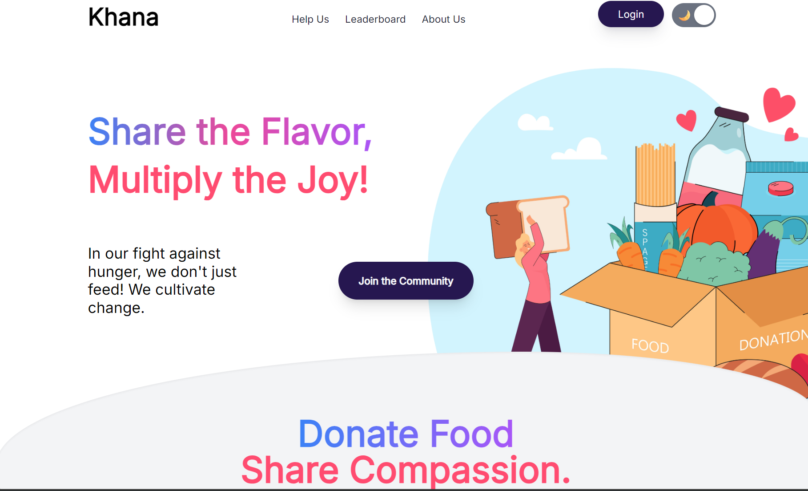
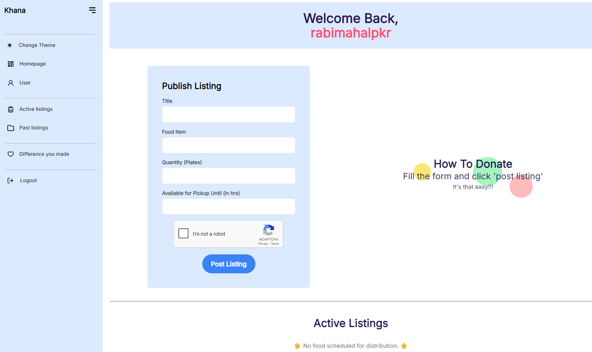
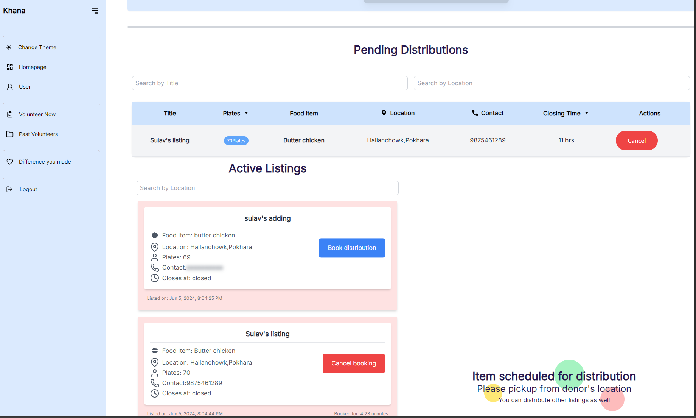

# Food Bridge (Khana.me)


**Food Bridge** is a community-driven platform designed to tackle the dual challenges of food wastage and food insecurity in Nepal. By bridging the gap between food businesses with excess inventory and individuals or organizations in need, we facilitate the efficient redistribution of surplus food, promoting sustainability and social responsibility.

The platform provides real-time listings of available excess food, allowing volunteers to book and distribute it to those in need.

---

## 🚀 Key Features

*   **Real-Time Listings**: Instant updates on available food donations from catering services and restaurants.
*   **Dual Portals**: Specialized interfaces for **Donors** (to list food) and **Volunteers/Organizations** (to claim food).
*   **Location-Based Filtering**: Easy discovery of donations based on geographical proximity.
*   **Secure Communication**: Donor contact details are revealed only after a booking is confirmed to ensure privacy.
*   **Leaderboard**: Gamified recognition system to honor top donors and encourage community participation.
*   **Data Visualization**: Dashboard analytics for tracking donations and impact.

---

## 🛠️ Tech Stack

### Frontend
*   **Framework**: React.js (Vite)
*   **Styling**: Tailwind CSS, PrimeReact
*   **State Management**: Redux Toolkit, Redux Persist
*   **Routing**: React Router DOM
*   **Forms**: React Hook Form
*   **Real-time**: Socket.io Client
*   **HTTP Client**: Axios

### Backend
*   **Runtime**: Node.js
*   **Framework**: Express.js
*   **Database**: MongoDB (Mongoose)
*   **Authentication**: JWT (JSON Web Tokens), Auth0
*   **File Storage**: Cloudinary (via Multer)
*   **Real-time**: Socket.io
*   **Email Service**: Nodemailer / Resend

---

## 📖 Project Context

### Background
In Nepal, cultural festivities often lead to significant food surplus. Simultaneously, many individuals struggle with food insecurity. **Food Bridge** was born from the motivation to solve this paradox using technology. By leveraging the increasing internet accessibility in Nepal, we created a digital bridge to connect surplus with scarcity.

### Problem Statement
The lack of a communication channel between those with excess food and those in need results in wastage of resources that could otherwise save lives. Food Bridge fills this void by providing a centralized platform for discovery and coordination.

### Objectives
*   **General**: To develop a user-friendly platform ("Khana.me") that facilitates food redistribution.
*   **Specific**:
    *   Establish a real-time connection between donors and recipients.
    *   Build a responsive web portal accessible on mobile and desktop.
    *   Create a robust database to manage listings and user data.

### Scope
*   **Real-time Listing**: Immediate visibility of donations.
*   **Location Filtering**: Search by area name.
*   **Privacy**: Contact info protection until booking.

### Limitations
*   **Verification**: Donation quality and donor identity are currently community-moderated.
*   **Logistics**: Transportation and packaging are the responsibility of the donor/volunteer.

---

## 🏁 Getting Started

Follow these steps to set up the project locally.

### Prerequisites
*   Node.js (v16 or higher)
*   MongoDB (Local or Atlas URI)
*   Cloudinary Account

### Installation

1.  **Clone the Repository**
    ```bash
    git clone https://github.com/Sanket2060/Bhojan.git
    cd Bhojan
    ```

2.  **Backend Setup**
    Navigate to the backend directory:
    ```bash
    cd bhojanbd
    npm install
    ```
    Create a `.env` file in `bhojanbd/` with the following variables:
    ```env
    PORT=8000
    MONGODB_URI=your_mongodb_connection_string
    CORS_ORIGIN=*
    ACCESS_TOKEN_SECRET=your_secret
    ACCESS_TOKEN_EXPIRY=1d
    REFRESH_TOKEN_SECRET=your_refresh_secret
    REFRESH_TOKEN_EXPIRY=10d
    CLOUDINARY_CLOUD_NAME=your_cloud_name
    CLOUDINARY_API_KEY=your_api_key
    CLOUDINARY_API_SECRET=your_api_secret
    ```
    Start the server:
    ```bash
    npm run dev
    ```

3.  **Frontend Setup**
    Navigate to the frontend directory:
    ```bash
    cd ../Bhojan
    npm install
    ```
    Start the development server:
    ```bash
    npm run dev
    ```

---

## 📸 Screenshots

| Landing Page | Donor Portal | Volunteer Portal |
|:---:|:---:|:---:|
|  |  |  |

---

## 🤝 Contribution

We welcome contributions to make Food Bridge better!
1.  Fork the repository.
2.  Create a new branch (`git checkout -b feature/AmazingFeature`).
3.  Commit your changes (`git commit -m 'Add some AmazingFeature'`).
4.  Push to the branch (`git push origin feature/AmazingFeature`).
5.  Open a Pull Request.

## 📄 License

This project is licensed under the ISC License.

---

**Developed with ❤️ for the Community.**
